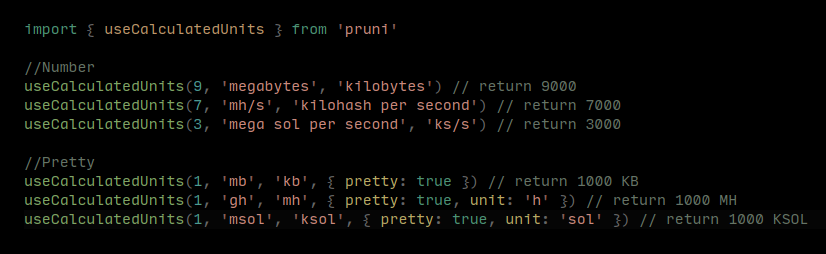

<h1 align='center'>pruni</h1>

<p align="center">

</p>

<p align="center">
<a href="https://www.npmjs.com/package/pruni" target="_blank"></a>
<a href="https://www.npmjs.com/package/pruni" target="_blank"></a>
<a href="https://www.npmjs.com/package/pruni" target="_blank"></a>
<a href="https://github.com/oritwoen/pruni" target="_blank"></a>
</p>

<p align="center">
Calculation of information units in any form and any format.
</p>

## Why?

When I wanted to create a script for calculating the profitability of cryptocurrency mining, I encountered a problem with formatting information units to one format from all potential formats.

I didn't feel like formatting or converting it in different formats every time, so I created this package.

## Install

```bash
npm install --save pruni

# Using pnpm
pnpm add pruni

# Using yarn
yarn add pruni
```


## Usage

```ts
import { useCalculatedUnits } from 'pruni'

//Number
useCalculatedUnits(9, 'megabytes', 'kilobytes') // return 9000
useCalculatedUnits(7, 'mh/s', 'kilohash per second') // return 7000
useCalculatedUnits(3, 'mega sol per second', 'ks/s') // return 3000

//Pretty
useCalculatedUnits(1, 'mb', 'kb', { pretty: true }) // return 1000 KB
useCalculatedUnits(1, 'gh', 'mh', { pretty: true, unit: 'h' }) // return 1000 MH
useCalculatedUnits(1, 'msol', 'ksol', { pretty: true, unit: 'sol' }) // return 1000 KSOL

```

## License

MIT License © 2023 [Dominik Opyd](https://github.com/oritwoen)
